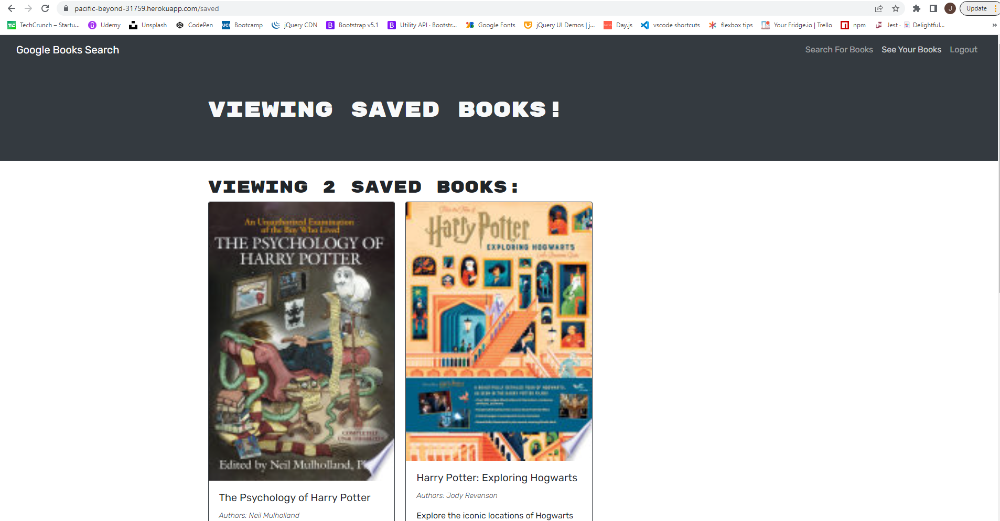

# book-search-engine

## Description

The motivation for this project was to create a full Mern stack application that utilizes an apollo server and graphql to store data. I built this to practice building out a functioning front end and back end with User authorization that uses React and Graphql. The application solves the problem of being able to search for books by various criteria and saving them for later. This will persist if you leave and log back in due to it being saved to your user profile. I learned a lot about how to connect the front and back end of the MERN application and to build the back end with an apollo server and graphql.

## Table of Contents (Optional)

- [Installation](#installation)
- [Usage](#usage)
- [Credits](#credits)
- [License](#license)

## Installation

To run application on machine run npm start or go to the live URL https://pacific-beyond-31759.herokuapp.com/

## Usage

To use you can enter the name or author of the book you are searching for and click search or hit enter. Click on the save button at the bottom of the book card to save for future reference. In order to save the book for later you must be logged in. You must click the login link on the top right and enter your email and password. If you are a new user you must register a new account and it will automatically sign you in and return you to the search page. You can click the link for your saved books to see all the books you have saved. Click the delete button on the bottom of the book card to remove a saved book from your saved books. 

## Credits

EDx Web Development Bootcamp starter code

## License

N/A